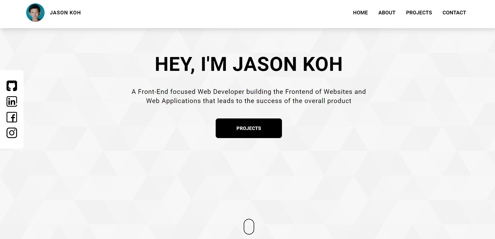

# Personal Website

  

# About
To build my own website and at the same time practice my Web Development skill. Front-end is build using React Typescript and styled with Tailwind CSS. Currently there is no back-end but the form is linked to a Google Sheets & the website is hosted on vercel.

This project was bootstrapped with [Create React App](https://github.com/facebook/create-react-app).

### `npm start`

Runs the app in the development mode.\
Open [http://localhost:3000](http://localhost:3000) to view it in the browser.

The page will reload if you make edits.\
You will also see any lint errors in the console.
