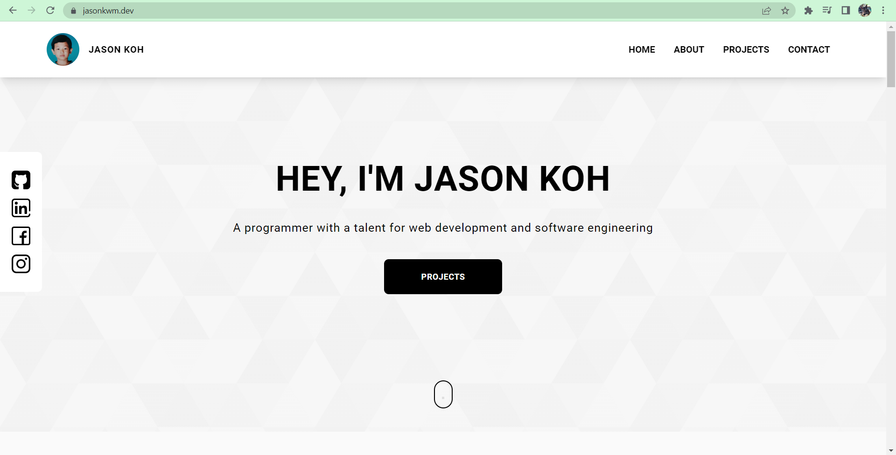

# Personal Website


<br></br>

# About

To build my website and at the same time practice my Web Development skills. Front-end is build using Typescript, NextJs, and styled with Tailwind CSS. Currently, there is no back-end but the form is linked to Google Sheets & the website is hosted on vercel.

This project was bootstrapped with [Create Next App](<[https://github.com/facebook/create-react-app](https://github.com/vercel/next.js/tree/canary/packages/create-next-app)>).

Runs the app locally.

```
yarn && yarn dev
```

Open [http://localhost:3000](http://localhost:3000) to view it in the browser.

The page will reload if you make edits.\
You will also see any lint errors in the console.
